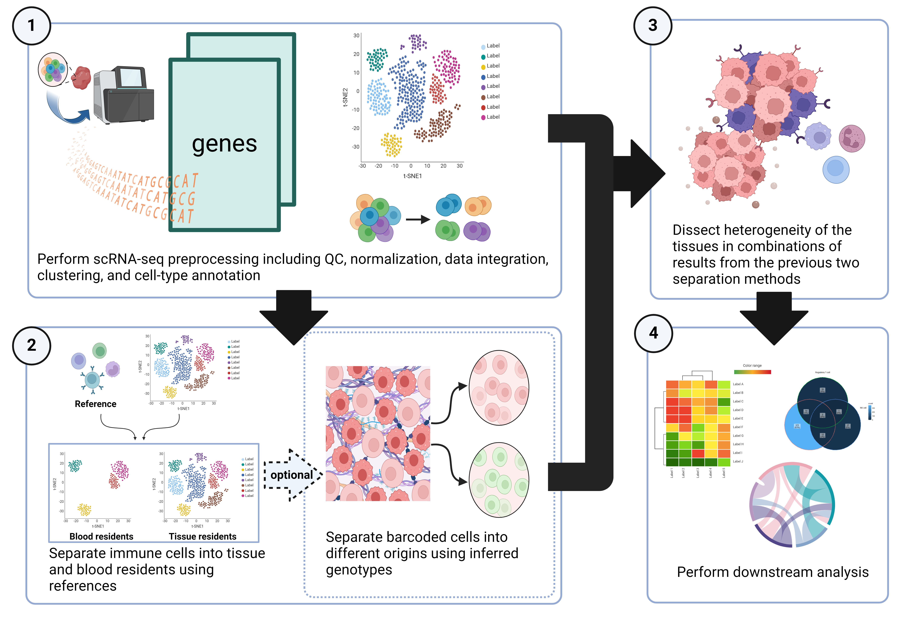

# Originator: Computational Framework Separating Single-Cell RNA-Seq by Genetic and Contextual Information

Single-cell RNA sequencing (scRNA-Seq) data from tissues are prone to blood contamination in sample preparation. Moreover, some tissue samples comprise cells of different genetic makeups. These issues require rigorous preprocessing and cell filtering prior to the downstream functional analysis. We propose a new computational framework, Originator, which deciphers single cells into different genetic origins and separates blood cells from tissue-resident cells in the scRNA-Seq data. 


**Illustration of Originator framework** The input data are the scRNA-Seq experiment on tissue sections. (1) data preprocessing and cell type annotation. (2) separating barcoded cells into different origins by blood vs tissue residents context and optionally by inferred genotype information. (3) using the results in steps (1) and (2) to dissect tissue heterogeneity. (4) the functional downstream analyses with respect to cells’ origins.

# Installation
Install dependencies
```R
install.packages("tidyr")
install.packages('Seurat')
install.packages("RColorBrewer")
install.packages("matrixStats")
```
Install Originator
```R
remotes::install_github("lanagarmire/Originator/Originator/")
```
# Tutorial
- [How to run Originator?](Originator/vignettes/Example.Rmd)
- [Perform blood and tissue-resident immune cell identification using Originator](tutorial/Originator_tutorial.md)
- [(OPTIONAL) Perform maternal and fetal origin identification in placenta tissues](tutorial/Originator_optional_placenta.md)


## Contributors
- [Thatchayut Unjitwattana](https://github.com/thatchayut) (thatchau@umich.edu)
- Qianhui Huang (qhhuang@umich.edu)
- [Yiwen Yang](https://github.com/remisiki) (yangiwen@umich.edu)
- Leyang Tao (johntao@umich.edu)
- [Youqi Yang](https://github.com/youqiy) (youqi@umich.edu)
- [Mengtian Zhou](https://github.com/mengtzhou) (mtzhouzz@umich.edu)
- [Yuheng Du](https://github.com/yhdu36) (yhdu@umich.edu)
- [Lana Garmire](https://github.com/lanagarmire) (http://garmiregroup.org/)
