Blood and Tissue-resident Identification using Originator
---------------------------------------------------------

Single-cell RNA sequencing (scRNA-Seq) data from tissues are prone to blood contamination in sample preparation. In this tutorial, we'll use the demo data containing the mixture of blood and tissue-resident immune cells to show that Originator can successfully separate this mixture into blood and tissue-resident immune cells.

### Install the package

``` r
remotes::install_github("thatchayut/Originator/Originator/")
```

    ## Skipping install of 'originator' from a github remote, the SHA1 (adc74487) has not changed since last install.
    ##   Use `force = TRUE` to force installation

### Prepare input data for Originator

Originator requires the user to provide:

1.  Seurat object for query data
2.  Seurat object containing the integration of query and reference data.

Toy datasets can be downloaded from: https://figshare.com/articles/dataset/Artificially_mixing_blood_and_tissue_scRNA-seq_data/25487980

``` r
library(originator)
library(Seurat)
```

    ## Warning: package 'Seurat' was built under R version 4.3.3

    ## Loading required package: SeuratObject

    ## Warning: package 'SeuratObject' was built under R version 4.3.3

    ## Loading required package: sp

    ## Warning: package 'sp' was built under R version 4.3.3

    ## 
    ## Attaching package: 'SeuratObject'

    ## The following object is masked from 'package:base':
    ## 
    ##     intersect

``` r
###### Prepare a query data
data_TB_annotation <- readRDS("./your_workspace/demo_query.rds")

head(data_TB_annotation@meta.data)
```

    ##                         orig.ident nCount_RNA nFeature_RNA percent.mt
    ## M1_AAACCCAAGAATACAC-1_1         M1      36639         6592   9.050465
    ## M1_AAACCCAAGACCAGCA-1_1         M1      28301         5255   7.501502
    ## M1_AAACCCAAGTTCATGC-1_1         M1      14979         3924   4.299352
    ## M1_AAACCCACAGCTATAC-1_1         M1      24108         5174  11.614402
    ## M1_AAACCCACATGATCTG-1_1         M1      13190         2982   8.779378
    ## M1_AAACCCAGTGGACTAG-1_1         M1      10439         3284   6.006322
    ##                         integrated_snn_res.0.5 seurat_clusters
    ## M1_AAACCCAAGAATACAC-1_1                     10               0
    ## M1_AAACCCAAGACCAGCA-1_1                      0               1
    ## M1_AAACCCAAGTTCATGC-1_1                     11              11
    ## M1_AAACCCACAGCTATAC-1_1                      2               6
    ## M1_AAACCCACATGATCTG-1_1                      0               1
    ## M1_AAACCCAGTGGACTAG-1_1                      5               9
    ##                           singleR_annotation integrated_snn_res.0.6
    ## M1_AAACCCAAGAATACAC-1_1 Embryonic_stem_cells                     17
    ## M1_AAACCCAAGACCAGCA-1_1     Epithelial_cells                      0
    ## M1_AAACCCAAGTTCATGC-1_1     Pro-B_cell_CD34+                     13
    ## M1_AAACCCACAGCTATAC-1_1     Epithelial_cells                      1
    ## M1_AAACCCACATGATCTG-1_1     Epithelial_cells                      7
    ## M1_AAACCCAGTGGACTAG-1_1              T_cells                      9
    ##                         singleR_annotation_immune final_annotation
    ## M1_AAACCCAAGAATACAC-1_1             T cells, CD4+  Epithelial cell
    ## M1_AAACCCAAGACCAGCA-1_1                   B cells  Epithelial cell
    ## M1_AAACCCAAGTTCATGC-1_1             T cells, CD4+           T-cell
    ## M1_AAACCCACAGCTATAC-1_1                   B cells  Epithelial cell
    ## M1_AAACCCACATGATCTG-1_1                   B cells  Epithelial cell
    ## M1_AAACCCAGTGGACTAG-1_1             T cells, CD8+           T-cell
    ##                         RNA_snn_res.0.6 compartment origin_groundtruth
    ## M1_AAACCCAAGAATACAC-1_1               0  Non-immune             Tissue
    ## M1_AAACCCAAGACCAGCA-1_1               1  Non-immune             Tissue
    ## M1_AAACCCAAGTTCATGC-1_1              11      Immune             Tissue
    ## M1_AAACCCACAGCTATAC-1_1               6  Non-immune             Tissue
    ## M1_AAACCCACATGATCTG-1_1               1  Non-immune             Tissue
    ## M1_AAACCCAGTGGACTAG-1_1               9      Immune             Tissue

``` r
DimPlot(data_TB_annotation, group.by = "final_annotation", split.by = "origin_groundtruth")
```

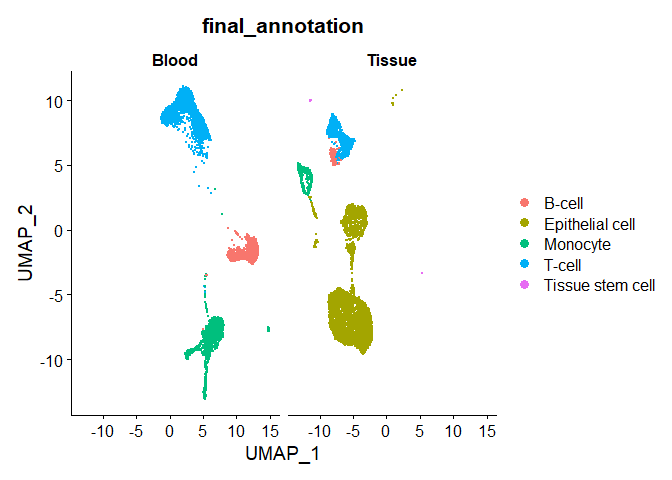

``` r
###### Prepare the integrated of the query data and the reference data
# This step can be done using data integration step provided by Seurat. 
wholeblood.integrated <- readRDS("./your_workspace/demo_wholeblood_query_integrated.rds")

head(wholeblood.integrated@meta.data)
```

    ##                                        assay_ontology_term_id donor_id
    ## AAACCCAAGCCGTCGT_TSP7_Blood_NA_10X_1_1            EFO:0009922     TSP7
    ## AAACCCACAGAATTCC_TSP7_Blood_NA_10X_1_1            EFO:0009922     TSP7
    ## AAACCCAGTACGTTCA_TSP7_Blood_NA_10X_1_1            EFO:0009922     TSP7
    ## AAACCCAGTCCCTCAT_TSP7_Blood_NA_10X_1_1            EFO:0009922     TSP7
    ## AAACCCAGTCTTCTAT_TSP7_Blood_NA_10X_1_1            EFO:0009922     TSP7
    ## AAACCCAGTGGCAACA_TSP7_Blood_NA_10X_1_1            EFO:0009922     TSP7
    ##                                        anatomical_information nCounts_RNA_UMIs
    ## AAACCCAAGCCGTCGT_TSP7_Blood_NA_10X_1_1                    nan             4799
    ## AAACCCACAGAATTCC_TSP7_Blood_NA_10X_1_1                    nan            12910
    ## AAACCCAGTACGTTCA_TSP7_Blood_NA_10X_1_1                    nan            11178
    ## AAACCCAGTCCCTCAT_TSP7_Blood_NA_10X_1_1                    nan             5996
    ## AAACCCAGTCTTCTAT_TSP7_Blood_NA_10X_1_1                    nan             8265
    ## AAACCCAGTGGCAACA_TSP7_Blood_NA_10X_1_1                    nan             6222
    ##                                        nFeaturess_RNA
    ## AAACCCAAGCCGTCGT_TSP7_Blood_NA_10X_1_1            212
    ## AAACCCACAGAATTCC_TSP7_Blood_NA_10X_1_1            303
    ## AAACCCAGTACGTTCA_TSP7_Blood_NA_10X_1_1           2670
    ## AAACCCAGTCCCTCAT_TSP7_Blood_NA_10X_1_1           2459
    ## AAACCCAGTCTTCTAT_TSP7_Blood_NA_10X_1_1           2631
    ## AAACCCAGTGGCAACA_TSP7_Blood_NA_10X_1_1            310
    ##                                                                                cell_ontology_class
    ## AAACCCAAGCCGTCGT_TSP7_Blood_NA_10X_1_1                                                 erythrocyte
    ## AAACCCACAGAATTCC_TSP7_Blood_NA_10X_1_1                                                 erythrocyte
    ## AAACCCAGTACGTTCA_TSP7_Blood_NA_10X_1_1                      cd4-positive, alpha-beta memory t cell
    ## AAACCCAGTCCCTCAT_TSP7_Blood_NA_10X_1_1 cd8-positive, alpha-beta cytokine secreting effector t cell
    ## AAACCCAGTCTTCTAT_TSP7_Blood_NA_10X_1_1                                          classical monocyte
    ## AAACCCAGTGGCAACA_TSP7_Blood_NA_10X_1_1                                                 erythrocyte
    ##                                                                                    free_annotation
    ## AAACCCAAGCCGTCGT_TSP7_Blood_NA_10X_1_1                                                 erythrocyte
    ## AAACCCACAGAATTCC_TSP7_Blood_NA_10X_1_1                                                 erythrocyte
    ## AAACCCAGTACGTTCA_TSP7_Blood_NA_10X_1_1                      cd4-positive, alpha-beta memory t cell
    ## AAACCCAGTCCCTCAT_TSP7_Blood_NA_10X_1_1 cd8-positive, alpha-beta cytokine secreting effector t cell
    ## AAACCCAGTCTTCTAT_TSP7_Blood_NA_10X_1_1                                          classical monocyte
    ## AAACCCAGTGGCAACA_TSP7_Blood_NA_10X_1_1                                                 erythrocyte
    ##                                        manually_annotated compartment
    ## AAACCCAAGCCGTCGT_TSP7_Blood_NA_10X_1_1               TRUE      immune
    ## AAACCCACAGAATTCC_TSP7_Blood_NA_10X_1_1               TRUE      immune
    ## AAACCCAGTACGTTCA_TSP7_Blood_NA_10X_1_1               TRUE      immune
    ## AAACCCAGTCCCTCAT_TSP7_Blood_NA_10X_1_1               TRUE      immune
    ## AAACCCAGTCTTCTAT_TSP7_Blood_NA_10X_1_1               TRUE      immune
    ## AAACCCAGTGGCAACA_TSP7_Blood_NA_10X_1_1               TRUE      immune
    ##                                        sex_ontology_term_id
    ## AAACCCAAGCCGTCGT_TSP7_Blood_NA_10X_1_1         PATO:0000383
    ## AAACCCACAGAATTCC_TSP7_Blood_NA_10X_1_1         PATO:0000383
    ## AAACCCAGTACGTTCA_TSP7_Blood_NA_10X_1_1         PATO:0000383
    ## AAACCCAGTCCCTCAT_TSP7_Blood_NA_10X_1_1         PATO:0000383
    ## AAACCCAGTCTTCTAT_TSP7_Blood_NA_10X_1_1         PATO:0000383
    ## AAACCCAGTGGCAACA_TSP7_Blood_NA_10X_1_1         PATO:0000383
    ##                                        disease_ontology_term_id is_primary_data
    ## AAACCCAAGCCGTCGT_TSP7_Blood_NA_10X_1_1             PATO:0000461           FALSE
    ## AAACCCACAGAATTCC_TSP7_Blood_NA_10X_1_1             PATO:0000461           FALSE
    ## AAACCCAGTACGTTCA_TSP7_Blood_NA_10X_1_1             PATO:0000461           FALSE
    ## AAACCCAGTCCCTCAT_TSP7_Blood_NA_10X_1_1             PATO:0000461           FALSE
    ## AAACCCAGTCTTCTAT_TSP7_Blood_NA_10X_1_1             PATO:0000461           FALSE
    ## AAACCCAGTGGCAACA_TSP7_Blood_NA_10X_1_1             PATO:0000461           FALSE
    ##                                        organism_ontology_term_id
    ## AAACCCAAGCCGTCGT_TSP7_Blood_NA_10X_1_1            NCBITaxon:9606
    ## AAACCCACAGAATTCC_TSP7_Blood_NA_10X_1_1            NCBITaxon:9606
    ## AAACCCAGTACGTTCA_TSP7_Blood_NA_10X_1_1            NCBITaxon:9606
    ## AAACCCAGTCCCTCAT_TSP7_Blood_NA_10X_1_1            NCBITaxon:9606
    ## AAACCCAGTCTTCTAT_TSP7_Blood_NA_10X_1_1            NCBITaxon:9606
    ## AAACCCAGTGGCAACA_TSP7_Blood_NA_10X_1_1            NCBITaxon:9606
    ##                                        suspension_type
    ## AAACCCAAGCCGTCGT_TSP7_Blood_NA_10X_1_1            cell
    ## AAACCCACAGAATTCC_TSP7_Blood_NA_10X_1_1            cell
    ## AAACCCAGTACGTTCA_TSP7_Blood_NA_10X_1_1            cell
    ## AAACCCAGTCCCTCAT_TSP7_Blood_NA_10X_1_1            cell
    ## AAACCCAGTCTTCTAT_TSP7_Blood_NA_10X_1_1            cell
    ## AAACCCAGTGGCAACA_TSP7_Blood_NA_10X_1_1            cell
    ##                                        cell_type_ontology_term_id
    ## AAACCCAAGCCGTCGT_TSP7_Blood_NA_10X_1_1                 CL:0000232
    ## AAACCCACAGAATTCC_TSP7_Blood_NA_10X_1_1                 CL:0000232
    ## AAACCCAGTACGTTCA_TSP7_Blood_NA_10X_1_1                 CL:0000897
    ## AAACCCAGTCCCTCAT_TSP7_Blood_NA_10X_1_1                 CL:0000908
    ## AAACCCAGTCTTCTAT_TSP7_Blood_NA_10X_1_1                 CL:0000860
    ## AAACCCAGTGGCAACA_TSP7_Blood_NA_10X_1_1                 CL:0000232
    ##                                        tissue_ontology_term_id
    ## AAACCCAAGCCGTCGT_TSP7_Blood_NA_10X_1_1          UBERON:0000178
    ## AAACCCACAGAATTCC_TSP7_Blood_NA_10X_1_1          UBERON:0000178
    ## AAACCCAGTACGTTCA_TSP7_Blood_NA_10X_1_1          UBERON:0000178
    ## AAACCCAGTCCCTCAT_TSP7_Blood_NA_10X_1_1          UBERON:0000178
    ## AAACCCAGTCTTCTAT_TSP7_Blood_NA_10X_1_1          UBERON:0000178
    ## AAACCCAGTGGCAACA_TSP7_Blood_NA_10X_1_1          UBERON:0000178
    ##                                        development_stage_ontology_term_id
    ## AAACCCAAGCCGTCGT_TSP7_Blood_NA_10X_1_1                     HsapDv:0000163
    ## AAACCCACAGAATTCC_TSP7_Blood_NA_10X_1_1                     HsapDv:0000163
    ## AAACCCAGTACGTTCA_TSP7_Blood_NA_10X_1_1                     HsapDv:0000163
    ## AAACCCAGTCCCTCAT_TSP7_Blood_NA_10X_1_1                     HsapDv:0000163
    ## AAACCCAGTCTTCTAT_TSP7_Blood_NA_10X_1_1                     HsapDv:0000163
    ## AAACCCAGTGGCAACA_TSP7_Blood_NA_10X_1_1                     HsapDv:0000163
    ##                                        self_reported_ethnicity_ontology_term_id
    ## AAACCCAAGCCGTCGT_TSP7_Blood_NA_10X_1_1                           HANCESTRO:0005
    ## AAACCCACAGAATTCC_TSP7_Blood_NA_10X_1_1                           HANCESTRO:0005
    ## AAACCCAGTACGTTCA_TSP7_Blood_NA_10X_1_1                           HANCESTRO:0005
    ## AAACCCAGTCCCTCAT_TSP7_Blood_NA_10X_1_1                           HANCESTRO:0005
    ## AAACCCAGTCTTCTAT_TSP7_Blood_NA_10X_1_1                           HANCESTRO:0005
    ## AAACCCAGTGGCAACA_TSP7_Blood_NA_10X_1_1                           HANCESTRO:0005
    ##                                        tissue_type
    ## AAACCCAAGCCGTCGT_TSP7_Blood_NA_10X_1_1      tissue
    ## AAACCCACAGAATTCC_TSP7_Blood_NA_10X_1_1      tissue
    ## AAACCCAGTACGTTCA_TSP7_Blood_NA_10X_1_1      tissue
    ## AAACCCAGTCCCTCAT_TSP7_Blood_NA_10X_1_1      tissue
    ## AAACCCAGTCTTCTAT_TSP7_Blood_NA_10X_1_1      tissue
    ## AAACCCAGTGGCAACA_TSP7_Blood_NA_10X_1_1      tissue
    ##                                                                                          cell_type
    ## AAACCCAAGCCGTCGT_TSP7_Blood_NA_10X_1_1                                                 erythrocyte
    ## AAACCCACAGAATTCC_TSP7_Blood_NA_10X_1_1                                                 erythrocyte
    ## AAACCCAGTACGTTCA_TSP7_Blood_NA_10X_1_1                      CD4-positive, alpha-beta memory T cell
    ## AAACCCAGTCCCTCAT_TSP7_Blood_NA_10X_1_1 CD8-positive, alpha-beta cytokine secreting effector T cell
    ## AAACCCAGTCTTCTAT_TSP7_Blood_NA_10X_1_1                                          classical monocyte
    ## AAACCCAGTGGCAACA_TSP7_Blood_NA_10X_1_1                                                 erythrocyte
    ##                                            assay disease     organism    sex
    ## AAACCCAAGCCGTCGT_TSP7_Blood_NA_10X_1_1 10x 3' v3  normal Homo sapiens female
    ## AAACCCACAGAATTCC_TSP7_Blood_NA_10X_1_1 10x 3' v3  normal Homo sapiens female
    ## AAACCCAGTACGTTCA_TSP7_Blood_NA_10X_1_1 10x 3' v3  normal Homo sapiens female
    ## AAACCCAGTCCCTCAT_TSP7_Blood_NA_10X_1_1 10x 3' v3  normal Homo sapiens female
    ## AAACCCAGTCTTCTAT_TSP7_Blood_NA_10X_1_1 10x 3' v3  normal Homo sapiens female
    ## AAACCCAGTGGCAACA_TSP7_Blood_NA_10X_1_1 10x 3' v3  normal Homo sapiens female
    ##                                        tissue self_reported_ethnicity
    ## AAACCCAAGCCGTCGT_TSP7_Blood_NA_10X_1_1  blood                European
    ## AAACCCACAGAATTCC_TSP7_Blood_NA_10X_1_1  blood                European
    ## AAACCCAGTACGTTCA_TSP7_Blood_NA_10X_1_1  blood                European
    ## AAACCCAGTCCCTCAT_TSP7_Blood_NA_10X_1_1  blood                European
    ## AAACCCAGTCTTCTAT_TSP7_Blood_NA_10X_1_1  blood                European
    ## AAACCCAGTGGCAACA_TSP7_Blood_NA_10X_1_1  blood                European
    ##                                              development_stage
    ## AAACCCAAGCCGTCGT_TSP7_Blood_NA_10X_1_1 69-year-old human stage
    ## AAACCCACAGAATTCC_TSP7_Blood_NA_10X_1_1 69-year-old human stage
    ## AAACCCAGTACGTTCA_TSP7_Blood_NA_10X_1_1 69-year-old human stage
    ## AAACCCAGTCCCTCAT_TSP7_Blood_NA_10X_1_1 69-year-old human stage
    ## AAACCCAGTCTTCTAT_TSP7_Blood_NA_10X_1_1 69-year-old human stage
    ## AAACCCAGTGGCAACA_TSP7_Blood_NA_10X_1_1 69-year-old human stage
    ##                                        observation_joinid level1_annotation
    ## AAACCCAAGCCGTCGT_TSP7_Blood_NA_10X_1_1         tJ2&+zdlob       erythrocyte
    ## AAACCCACAGAATTCC_TSP7_Blood_NA_10X_1_1         Ylb|HRe+5D       erythrocyte
    ## AAACCCAGTACGTTCA_TSP7_Blood_NA_10X_1_1         7W>QVAeTpm            T-cell
    ## AAACCCAGTCCCTCAT_TSP7_Blood_NA_10X_1_1         `v_J75rtzh            T-cell
    ## AAACCCAGTCTTCTAT_TSP7_Blood_NA_10X_1_1         TFr5sEI>X2          monocyte
    ## AAACCCAGTGGCAACA_TSP7_Blood_NA_10X_1_1         ^XO4N8~r$F       erythrocyte
    ##                                        nCount_RNA nFeature_RNA orig.ident
    ## AAACCCAAGCCGTCGT_TSP7_Blood_NA_10X_1_1       4837          301       <NA>
    ## AAACCCACAGAATTCC_TSP7_Blood_NA_10X_1_1      13088          448       <NA>
    ## AAACCCAGTACGTTCA_TSP7_Blood_NA_10X_1_1      10997         2580       <NA>
    ## AAACCCAGTCCCTCAT_TSP7_Blood_NA_10X_1_1       5724         2375       <NA>
    ## AAACCCAGTCTTCTAT_TSP7_Blood_NA_10X_1_1       8097         2575       <NA>
    ## AAACCCAGTGGCAACA_TSP7_Blood_NA_10X_1_1       6750          563       <NA>
    ##                                        percent.mt integrated_snn_res.0.5
    ## AAACCCAAGCCGTCGT_TSP7_Blood_NA_10X_1_1         NA                   <NA>
    ## AAACCCACAGAATTCC_TSP7_Blood_NA_10X_1_1         NA                   <NA>
    ## AAACCCAGTACGTTCA_TSP7_Blood_NA_10X_1_1         NA                   <NA>
    ## AAACCCAGTCCCTCAT_TSP7_Blood_NA_10X_1_1         NA                   <NA>
    ## AAACCCAGTCTTCTAT_TSP7_Blood_NA_10X_1_1         NA                   <NA>
    ## AAACCCAGTGGCAACA_TSP7_Blood_NA_10X_1_1         NA                   <NA>
    ##                                        seurat_clusters singleR_annotation
    ## AAACCCAAGCCGTCGT_TSP7_Blood_NA_10X_1_1               0               <NA>
    ## AAACCCACAGAATTCC_TSP7_Blood_NA_10X_1_1               0               <NA>
    ## AAACCCAGTACGTTCA_TSP7_Blood_NA_10X_1_1               3               <NA>
    ## AAACCCAGTCCCTCAT_TSP7_Blood_NA_10X_1_1               5               <NA>
    ## AAACCCAGTCTTCTAT_TSP7_Blood_NA_10X_1_1               1               <NA>
    ## AAACCCAGTGGCAACA_TSP7_Blood_NA_10X_1_1               0               <NA>
    ##                                        integrated_snn_res.0.6
    ## AAACCCAAGCCGTCGT_TSP7_Blood_NA_10X_1_1                   <NA>
    ## AAACCCACAGAATTCC_TSP7_Blood_NA_10X_1_1                   <NA>
    ## AAACCCAGTACGTTCA_TSP7_Blood_NA_10X_1_1                   <NA>
    ## AAACCCAGTCCCTCAT_TSP7_Blood_NA_10X_1_1                   <NA>
    ## AAACCCAGTCTTCTAT_TSP7_Blood_NA_10X_1_1                   <NA>
    ## AAACCCAGTGGCAACA_TSP7_Blood_NA_10X_1_1                   <NA>
    ##                                        singleR_annotation_immune
    ## AAACCCAAGCCGTCGT_TSP7_Blood_NA_10X_1_1                      <NA>
    ## AAACCCACAGAATTCC_TSP7_Blood_NA_10X_1_1                      <NA>
    ## AAACCCAGTACGTTCA_TSP7_Blood_NA_10X_1_1                      <NA>
    ## AAACCCAGTCCCTCAT_TSP7_Blood_NA_10X_1_1                      <NA>
    ## AAACCCAGTCTTCTAT_TSP7_Blood_NA_10X_1_1                      <NA>
    ## AAACCCAGTGGCAACA_TSP7_Blood_NA_10X_1_1                      <NA>
    ##                                        final_annotation RNA_snn_res.0.6
    ## AAACCCAAGCCGTCGT_TSP7_Blood_NA_10X_1_1             <NA>            <NA>
    ## AAACCCACAGAATTCC_TSP7_Blood_NA_10X_1_1             <NA>            <NA>
    ## AAACCCAGTACGTTCA_TSP7_Blood_NA_10X_1_1             <NA>            <NA>
    ## AAACCCAGTCCCTCAT_TSP7_Blood_NA_10X_1_1             <NA>            <NA>
    ## AAACCCAGTCTTCTAT_TSP7_Blood_NA_10X_1_1             <NA>            <NA>
    ## AAACCCAGTGGCAACA_TSP7_Blood_NA_10X_1_1             <NA>            <NA>
    ##                                        origin_groundtruth
    ## AAACCCAAGCCGTCGT_TSP7_Blood_NA_10X_1_1               <NA>
    ## AAACCCACAGAATTCC_TSP7_Blood_NA_10X_1_1               <NA>
    ## AAACCCAGTACGTTCA_TSP7_Blood_NA_10X_1_1               <NA>
    ## AAACCCAGTCCCTCAT_TSP7_Blood_NA_10X_1_1               <NA>
    ## AAACCCAGTCTTCTAT_TSP7_Blood_NA_10X_1_1               <NA>
    ## AAACCCAGTGGCAACA_TSP7_Blood_NA_10X_1_1               <NA>
    ##                                        integrated_snn_res.0.4
    ## AAACCCAAGCCGTCGT_TSP7_Blood_NA_10X_1_1                      0
    ## AAACCCACAGAATTCC_TSP7_Blood_NA_10X_1_1                      0
    ## AAACCCAGTACGTTCA_TSP7_Blood_NA_10X_1_1                      3
    ## AAACCCAGTCCCTCAT_TSP7_Blood_NA_10X_1_1                      5
    ## AAACCCAGTCTTCTAT_TSP7_Blood_NA_10X_1_1                      1
    ## AAACCCAGTGGCAACA_TSP7_Blood_NA_10X_1_1                      0

Originator requires the integrated dataset to explicitly specify *Ref <celltype>* and *Query <celltype>* in the metadata column *annotation\_query\_ref*. We'll prepare the integrated dataset to meet the criteria.

``` r
# Define query and reference on common immune cell types
## Query side: T-cell, B-cell, Monocyte
## Reference side: T-cell, B cell, monocyte

list_common_immune_query <- c("T-cell", "B-cell", "Monocyte")
list_common_immune_reference <- c("T-cell", "B cell", "monocyte")


wholeblood.integrated_meta <- wholeblood.integrated@meta.data

wholeblood.integrated_meta$annotation_query_ref <- rep(NA, nrow(wholeblood.integrated_meta))

wholeblood.integrated_meta$annotation_query_ref[wholeblood.integrated_meta$final_annotation == "T-cell"] <- "Query T-cell"
wholeblood.integrated_meta$annotation_query_ref[wholeblood.integrated_meta$final_annotation == "B-cell"] <- "Query B-cell"
wholeblood.integrated_meta$annotation_query_ref[wholeblood.integrated_meta$final_annotation == "Monocyte"] <- "Query monocyte"

wholeblood.integrated_meta$annotation_query_ref[wholeblood.integrated_meta$level1_annotation == "T-cell"] <- "Ref T-cell"
wholeblood.integrated_meta$annotation_query_ref[wholeblood.integrated_meta$level1_annotation == "B cell"] <- "Ref B-cell"
wholeblood.integrated_meta$annotation_query_ref[wholeblood.integrated_meta$level1_annotation == "monocyte"] <- "Ref monocyte"

wholeblood.integrated_meta$orig.ident[wholeblood.integrated_meta$final_annotation == "T-cell"] <- "Query"
wholeblood.integrated_meta$orig.ident[wholeblood.integrated_meta$final_annotation == "B-cell"] <- "Query"
wholeblood.integrated_meta$orig.ident[wholeblood.integrated_meta$final_annotation == "Monocyte"] <- "Query"

wholeblood.integrated_meta$orig.ident[wholeblood.integrated_meta$level1_annotation == "T-cell"] <- "Ref"
wholeblood.integrated_meta$orig.ident[wholeblood.integrated_meta$level1_annotation == "B cell"] <- "Ref"
wholeblood.integrated_meta$orig.ident[wholeblood.integrated_meta$level1_annotation == "monocyte"] <- "Ref"

wholeblood.integrated.common.immune <- wholeblood.integrated

wholeblood.integrated.common.immune@meta.data <-  wholeblood.integrated_meta

list_annotation_query_ref <- unlist(unique(wholeblood.integrated.common.immune$annotation_query_ref))
list_annotation_query_ref <-  list_annotation_query_ref[is.na(list_annotation_query_ref) == FALSE]

# Subset to get only cell types of interests
wholeblood.integrated.common.immune <- subset(wholeblood.integrated.common.immune,
                                              subset = annotation_query_ref %in% list_annotation_query_ref)
```

    ## Warning: Removing 23243 cells missing data for vars requested

### Perform blood and tissue-immune cell identification using Originator

``` r
tb_annotation_tcell <- originator(data = wholeblood.integrated.common.immune, query_cell_type = "T-cell", plot = TRUE, output_dir = "./")
```

    ## [1] "#### Generate UMAP plot comparing cells from query and reference"

    ## Warning in RColorBrewer::brewer.pal(n = 14, name = "RdYlBu"): n too large, allowed maximum for palette RdYlBu is 11
    ## Returning the palette you asked for with that many colors

    ## [1] "#### Extract UMAP embeddings 1-10"
    ## [1] "min_umap1: -3.05807915050176"
    ## [1] "max_umap1: -0.887539163414506"
    ## [1] "min_umap2: -5.86495033458487"
    ## [1] "max_umap2: 4.64015487476571"
    ## [1] "#### Perform clustering"
    ## [1] "#### Generate heatmaps of median distance plot between query and reference"

``` r
tb_annotation_monocyte <- originator(data = wholeblood.integrated.common.immune, query_cell_type = "monocyte", plot = TRUE, output_dir = "./")
```

    ## [1] "#### Generate UMAP plot comparing cells from query and reference"

    ## Warning in RColorBrewer::brewer.pal(n = 14, name = "RdYlBu"): n too large, allowed maximum for palette RdYlBu is 11
    ## Returning the palette you asked for with that many colors

    ## [1] "#### Extract UMAP embeddings 1-10"
    ## [1] "min_umap1: -3.19252147990849"
    ## [1] "max_umap1: 6.87120442074153"
    ## [1] "min_umap2: -6.01801601604239"
    ## [1] "max_umap2: 5.89611724659188"
    ## [1] "#### Perform clustering"
    ## [1] "#### Generate heatmaps of median distance plot between query and reference"

``` r
tb_annotation_bcell <- originator(data = wholeblood.integrated.common.immune, query_cell_type = "B-cell", plot = TRUE, output_dir = "./")
```

    ## [1] "#### Generate UMAP plot comparing cells from query and reference"

    ## Warning in RColorBrewer::brewer.pal(n = 14, name = "RdYlBu"): n too large, allowed maximum for palette RdYlBu is 11
    ## Returning the palette you asked for with that many colors

    ## [1] "#### Extract UMAP embeddings 1-10"
    ## [1] "min_umap1: -2.89676347095158"
    ## [1] "max_umap1: 0.138637557443115"
    ## [1] "min_umap2: -6.10460344508902"
    ## [1] "max_umap2: 4.15647176548226"
    ## [1] "#### Perform clustering"
    ## [1] "#### Generate heatmaps of median distance plot between query and reference"

Originator returns dataframe (N x 2; N = number of query samples): Blood and tissue-resident immune cell identification result is stored in *origin\_tb*. Row names are query sample IDs.

If *plot* is set as TRUE, the following plots will be generated to the output directory specified in *output\_dir*.

1.  UMAP plot comparing query and reference data
2.  Heatmap of the distance between each cluster identified by Originator. The higher values imply a further distance from the reference data, inferring a tissue-resident immune cell cluster. On the other hand, the lower values imply a closer distance to reference data, inferring a blood immune cell cluster.

##### UMAP plot comparing query and reference data of T-cells
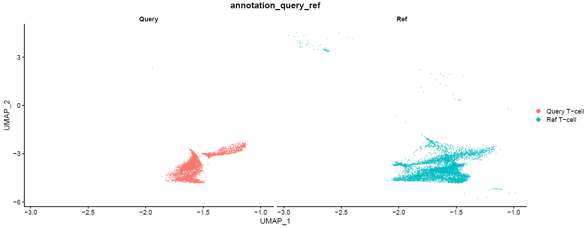

##### Heatmap of the distance between query and reference T-cells
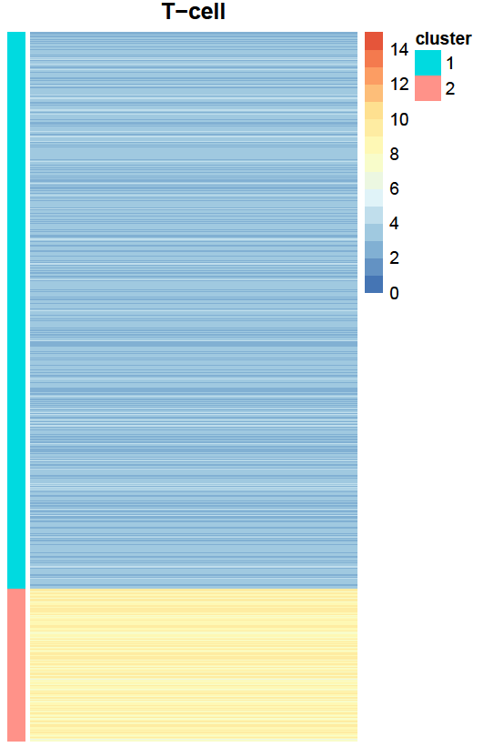

##### UMAP plot comparing query and reference data of monocytes
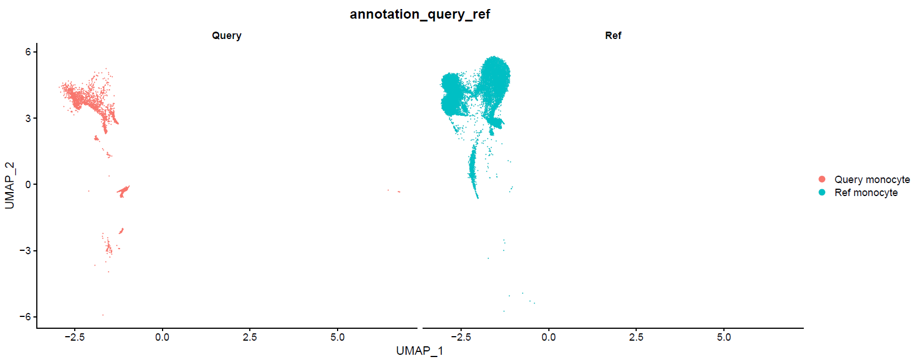

##### Heatmap of the distance between query and reference monocytes
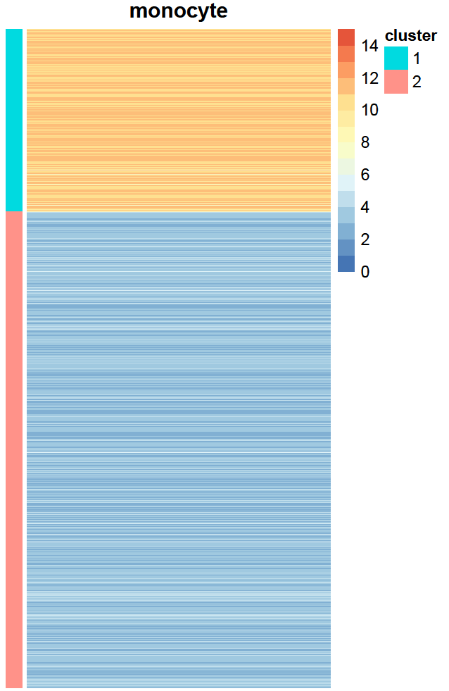

##### UMAP plot comparing query and reference data of B-cells
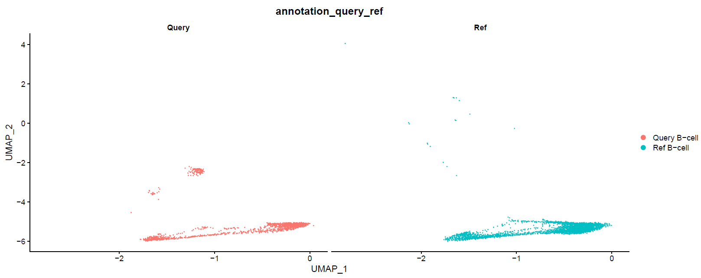

##### Heatmap of the distance between query and reference B-cells
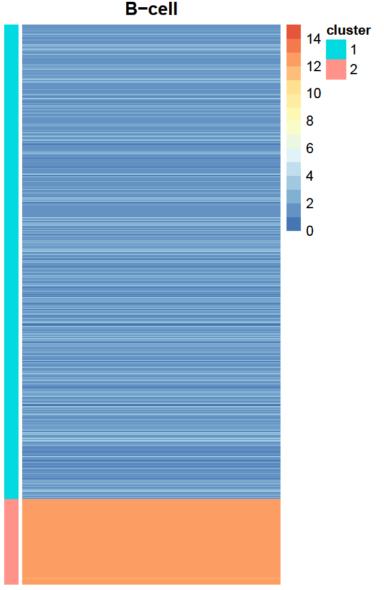

Combine Orignator results from different immune cell types together.

### Blood and tissue-resident immune cell assignment

Add the Originator outputs back to the input Seurat object to perform further analysis.

``` r
data_TB_annotation_meta <- data_TB_annotation@meta.data

### tissue and blood origin assignment
data_TB_annotation_meta_1 <- data_TB_annotation_meta[!(row.names(data_TB_annotation_meta) %in% row.names(temp_meta)), ]
data_TB_annotation_meta_1$TB_origin_wholeblood <- rep("Undetermined", dim(data_TB_annotation_meta_1)[1])

data_TB_annotation_meta_1$TB_origin_wholeblood[data_TB_annotation_meta_1$compartment == "Non-immune"] <- "Tissue"

data_TB_annotation_meta_2 <- data_TB_annotation_meta_1[, "TB_origin_wholeblood", drop = F]

temp_meta <- temp_meta[, "origin_tb", drop = F]
colnames(temp_meta) <- "TB_origin_wholeblood"

temp_meta <- rbind(temp_meta, data_TB_annotation_meta_2)

temp_meta <- temp_meta[row.names(data_TB_annotation_meta), , drop = F]

data_TB_annotation[["TB_origin_wholeblood"]] <- temp_meta$TB_origin_wholeblood
```

#### Comparing ground truth and Originator results

##### Visualization of all cell types

``` r
DimPlot(data_TB_annotation, group.by = "origin_groundtruth")
```

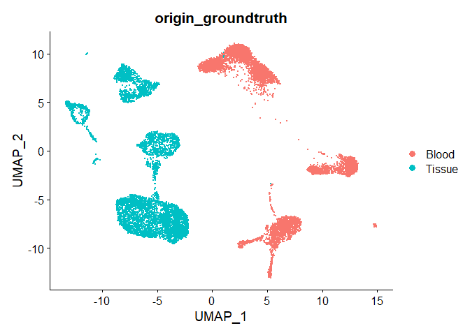

``` r
DimPlot(data_TB_annotation, group.by = "TB_origin_wholeblood")
```


##### Visualization of T-cells

``` r
data_TB_annotation_tcell <- subset(data_TB_annotation, subset = final_annotation == "T-cell")

DimPlot(data_TB_annotation_tcell, group.by = "origin_groundtruth")
```

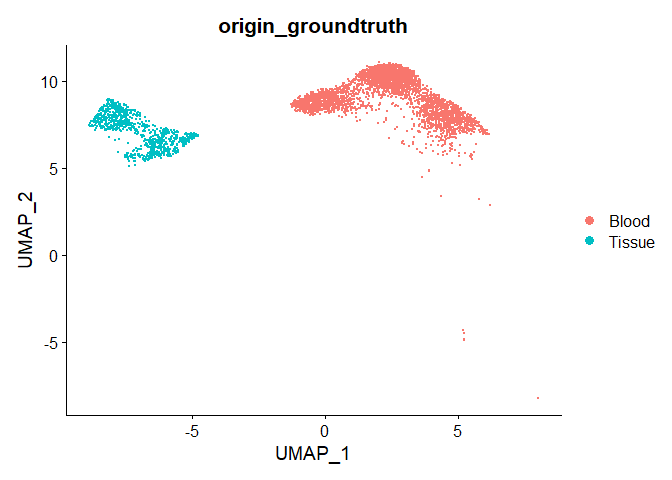

``` r
DimPlot(data_TB_annotation_tcell, group.by = "TB_origin_wholeblood")
```

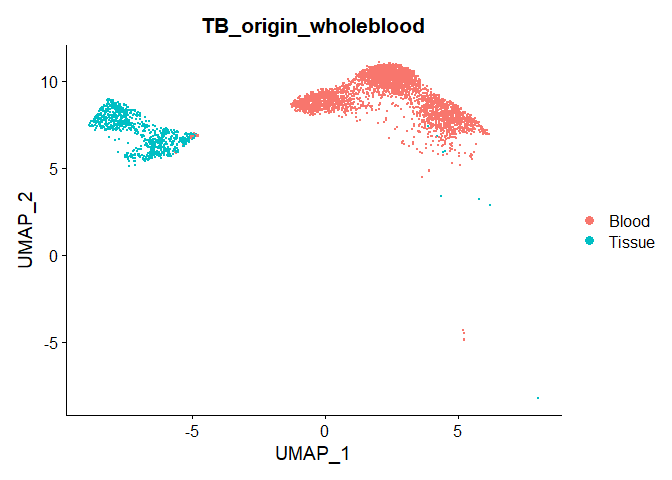

##### Visualization of monocytes

``` r
data_TB_annotation_monocyte <- subset(data_TB_annotation, subset = final_annotation == "Monocyte")

DimPlot(data_TB_annotation_monocyte, group.by = "origin_groundtruth")
```

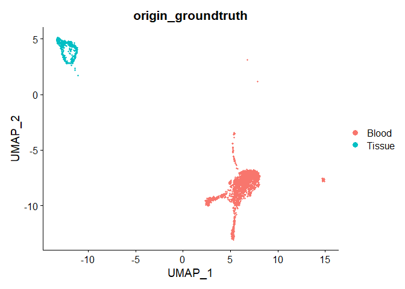

``` r
DimPlot(data_TB_annotation_monocyte, group.by = "TB_origin_wholeblood")
```

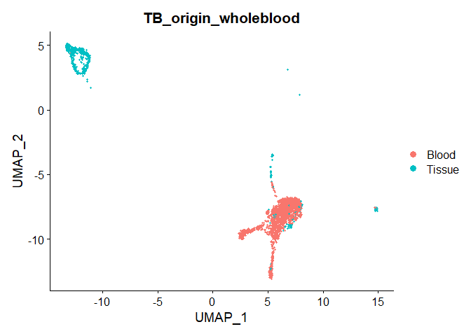

##### Visualization of B-cells

``` r
data_TB_annotation_Bcell <- subset(data_TB_annotation, subset = final_annotation == "B-cell")

DimPlot(data_TB_annotation_Bcell, group.by = "origin_groundtruth")
```

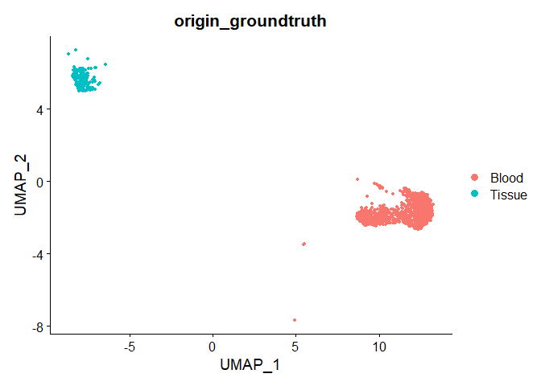

``` r
DimPlot(data_TB_annotation_Bcell, group.by = "TB_origin_wholeblood")
```

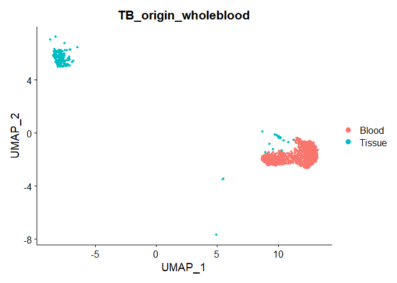

``` r
sessionInfo()
```

    ## R version 4.3.0 (2023-04-21 ucrt)
    ## Platform: x86_64-w64-mingw32/x64 (64-bit)
    ## Running under: Windows 10 x64 (build 19044)
    ## 
    ## Matrix products: default
    ## 
    ## 
    ## locale:
    ## [1] LC_COLLATE=English_United States.utf8 
    ## [2] LC_CTYPE=English_United States.utf8   
    ## [3] LC_MONETARY=English_United States.utf8
    ## [4] LC_NUMERIC=C                          
    ## [5] LC_TIME=English_United States.utf8    
    ## 
    ## time zone: America/New_York
    ## tzcode source: internal
    ## 
    ## attached base packages:
    ## [1] stats     graphics  grDevices utils     datasets  methods   base     
    ## 
    ## other attached packages:
    ## [1] Seurat_5.0.2          SeuratObject_5.0.1    sp_2.1-3             
    ## [4] originator_0.0.0.9000
    ## 
    ## loaded via a namespace (and not attached):
    ##   [1] deldir_2.0-4           pbapply_1.7-2          gridExtra_2.3         
    ##   [4] remotes_2.5.0          rlang_1.1.3            magrittr_2.0.3        
    ##   [7] RcppAnnoy_0.0.22       spatstat.geom_3.2-9    matrixStats_1.2.0     
    ##  [10] ggridges_0.5.6         compiler_4.3.0         png_0.1-8             
    ##  [13] vctrs_0.6.5            reshape2_1.4.4         stringr_1.5.1         
    ##  [16] pkgconfig_2.0.3        fastmap_1.1.1          ellipsis_0.3.2        
    ##  [19] labeling_0.4.3         utf8_1.2.4             promises_1.2.1        
    ##  [22] rmarkdown_2.26         purrr_1.0.2            xfun_0.42             
    ##  [25] jsonlite_1.8.8         goftest_1.2-3          highr_0.10            
    ##  [28] later_1.3.2            spatstat.utils_3.0-4   irlba_2.3.5.1         
    ##  [31] parallel_4.3.0         cluster_2.1.6          R6_2.5.1              
    ##  [34] ica_1.0-3              spatstat.data_3.0-4    stringi_1.8.3         
    ##  [37] RColorBrewer_1.1-3     reticulate_1.35.0      parallelly_1.37.1     
    ##  [40] lmtest_0.9-40          scattermore_1.2        Rcpp_1.0.12           
    ##  [43] knitr_1.45             tensor_1.5             future.apply_1.11.1   
    ##  [46] zoo_1.8-12             sctransform_0.4.1      httpuv_1.6.14         
    ##  [49] Matrix_1.6-5           splines_4.3.0          igraph_2.0.2          
    ##  [52] tidyselect_1.2.1       abind_1.4-5            rstudioapi_0.16.0     
    ##  [55] yaml_2.3.7             spatstat.random_3.2-3  spatstat.explore_3.2-6
    ##  [58] codetools_0.2-19       miniUI_0.1.1.1         curl_5.2.1            
    ##  [61] listenv_0.9.1          lattice_0.22-5         tibble_3.2.1          
    ##  [64] plyr_1.8.9             withr_3.0.0            shiny_1.8.0           
    ##  [67] ROCR_1.0-11            evaluate_0.23          Rtsne_0.17            
    ##  [70] future_1.33.1          fastDummies_1.7.3      survival_3.5-8        
    ##  [73] polyclip_1.10-6        fitdistrplus_1.1-11    pillar_1.9.0          
    ##  [76] KernSmooth_2.23-22     plotly_4.10.4          generics_0.1.3        
    ##  [79] RcppHNSW_0.6.0         ggplot2_3.5.0          munsell_0.5.0         
    ##  [82] scales_1.3.0           globals_0.16.3         xtable_1.8-4          
    ##  [85] glue_1.7.0             pheatmap_1.0.12        lazyeval_0.2.2        
    ##  [88] tools_4.3.0            data.table_1.15.2      RSpectra_0.16-1       
    ##  [91] RANN_2.6.1             leiden_0.4.3.1         dotCall64_1.1-1       
    ##  [94] cowplot_1.1.3          grid_4.3.0             tidyr_1.3.1           
    ##  [97] colorspace_2.1-0       nlme_3.1-164           patchwork_1.2.0       
    ## [100] cli_3.6.2              spatstat.sparse_3.0-3  spam_2.10-0           
    ## [103] fansi_1.0.6            viridisLite_0.4.2      dplyr_1.1.4           
    ## [106] uwot_0.1.16            gtable_0.3.4           digest_0.6.35         
    ## [109] progressr_0.14.0       ggrepel_0.9.5          farver_2.1.1          
    ## [112] htmlwidgets_1.6.4      htmltools_0.5.7        lifecycle_1.0.4       
    ## [115] httr_1.4.7             mime_0.12              MASS_7.3-60.0.1
