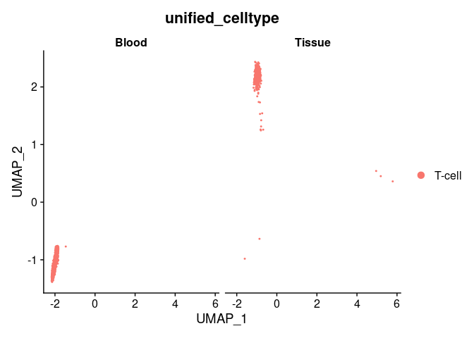
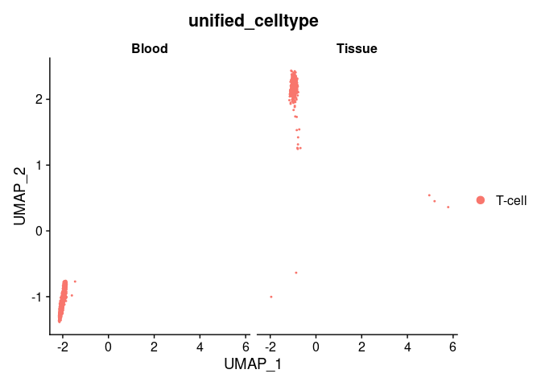

Originator tutorial
================
2025-01-13

# Blood and Tissue-resident Identification using Originator

Single-cell RNA sequencing (scRNA-Seq) data from tissues are prone to
blood contamination in sample preparation. In this tutorial, we’ll use
the demo data containing the mixture of blood and tissue-resident immune
cells to show that Originator can successfully separate this mixture
into blood and tissue-resident immune cells.

## Install Originator

``` r
# Install Originator if you haven't done already.
# remotes::install_github("lanagarmire/Originator/Originator/")
```

## Prepare input data for Originator

Originator requires the user to provide: 1. Seurat object for query data
2. Seurat object of the reference data

Toy datasets can be downloaded from:
<https://figshare.com/articles/dataset/Artificially_mixing_blood_and_tissue_scRNA-seq_data/25487980>

``` r
library(Originator)
```

    ## Loading required package: dplyr

    ## 
    ## Attaching package: 'dplyr'

    ## The following objects are masked from 'package:stats':
    ## 
    ##     filter, lag

    ## The following objects are masked from 'package:base':
    ## 
    ##     intersect, setdiff, setequal, union

``` r
library(Seurat)
```

    ## Attaching SeuratObject

``` r
###### Prepare a query data
data_query <- readRDS("./demo_query.rds")

head(data_query@meta.data)
```

    ##                         orig.ident nCount_RNA nFeature_RNA percent.mt
    ## M1_AAACCCAAGAATACAC-1_1         M1      36639         6592   9.050465
    ## M1_AAACCCAAGACCAGCA-1_1         M1      28301         5255   7.501502
    ## M1_AAACCCAAGTTCATGC-1_1         M1      14979         3924   4.299352
    ## M1_AAACCCACAGCTATAC-1_1         M1      24108         5174  11.614402
    ## M1_AAACCCACATGATCTG-1_1         M1      13190         2982   8.779378
    ## M1_AAACCCAGTGGACTAG-1_1         M1      10439         3284   6.006322
    ##                         integrated_snn_res.0.5 seurat_clusters
    ## M1_AAACCCAAGAATACAC-1_1                     10               0
    ## M1_AAACCCAAGACCAGCA-1_1                      0               1
    ## M1_AAACCCAAGTTCATGC-1_1                     11              11
    ## M1_AAACCCACAGCTATAC-1_1                      2               6
    ## M1_AAACCCACATGATCTG-1_1                      0               1
    ## M1_AAACCCAGTGGACTAG-1_1                      5               9
    ##                           singleR_annotation integrated_snn_res.0.6
    ## M1_AAACCCAAGAATACAC-1_1 Embryonic_stem_cells                     17
    ## M1_AAACCCAAGACCAGCA-1_1     Epithelial_cells                      0
    ## M1_AAACCCAAGTTCATGC-1_1     Pro-B_cell_CD34+                     13
    ## M1_AAACCCACAGCTATAC-1_1     Epithelial_cells                      1
    ## M1_AAACCCACATGATCTG-1_1     Epithelial_cells                      7
    ## M1_AAACCCAGTGGACTAG-1_1              T_cells                      9
    ##                         singleR_annotation_immune final_annotation
    ## M1_AAACCCAAGAATACAC-1_1             T cells, CD4+  Epithelial cell
    ## M1_AAACCCAAGACCAGCA-1_1                   B cells  Epithelial cell
    ## M1_AAACCCAAGTTCATGC-1_1             T cells, CD4+           T-cell
    ## M1_AAACCCACAGCTATAC-1_1                   B cells  Epithelial cell
    ## M1_AAACCCACATGATCTG-1_1                   B cells  Epithelial cell
    ## M1_AAACCCAGTGGACTAG-1_1             T cells, CD8+           T-cell
    ##                         RNA_snn_res.0.6 compartment origin_groundtruth
    ## M1_AAACCCAAGAATACAC-1_1               0  Non-immune             Tissue
    ## M1_AAACCCAAGACCAGCA-1_1               1  Non-immune             Tissue
    ## M1_AAACCCAAGTTCATGC-1_1              11      Immune             Tissue
    ## M1_AAACCCACAGCTATAC-1_1               6  Non-immune             Tissue
    ## M1_AAACCCACATGATCTG-1_1               1  Non-immune             Tissue
    ## M1_AAACCCAGTGGACTAG-1_1               9      Immune             Tissue

``` r
DimPlot(data_query, group.by = "final_annotation", split.by = "origin_groundtruth")
```

<!-- -->
The next step will require the integrated data of the query and the
reference data. As this step may require high computational cost
depending on your reference data of interest, we’ve provided a toy
integrated data set that contains the integrated data of the toy query
data and the blood scRNA-seq reference data provided by Tabula Sapiens
(<https://www.science.org/doi/10.1126/science.abl4896>)

``` r
wholeblood_reference <- readRDS("./wholeblood_reference.rds")
```

In order to ensure that cell type in query and reference data have the
same name, you can use mapCellTypes() function to prepare cell type name
as follows. We will use NK cell as an example.

``` r
#### Map "T-cell" in data_query$final_annotation data to "T-cell" as a unified cell type to map with the reference. Unified cell type name will be added to `unified_celltype` column

#### Please follow this format: 
####    celltype_map_query <- list( `<query_celltype>` = "<unified_celltype>")
celltype_map_query <- list(
  `T-cell` = "T-cell"
)

data_query <- mapCellTypes(data_query, "final_annotation", celltype_map_query)

#### Map "T-cell" in wholeblood_reference$level1_annotation data to "T-cell" as a unified cell type to map with the query. Unified cell type name will be added to `unified_celltype` column

#### Please follow this format: 
####    celltype_map_query <- list( `<reference_celltype>` = "<unified_celltype>")
celltype_map_ref <- list(
  `T-cell` = "T-cell"
)

wholeblood_reference <- mapCellTypes(wholeblood_reference, "level1_annotation", celltype_map_ref)
```

Since we already ensured that T-cells in query and reference have the
same name, we can perform data integration of query and reference data.

``` r
#### Use harmony to integrate query and reference
integrated_data <- integrateBloodRef(wholeblood_reference, data_query)
```

    ## Centering and scaling data matrix

    ## PC_ 1 
    ## Positive:  TMSB4X, MALAT1, PFN1, ACTG1, B2M, ACTB, ARHGDIB, TPM3, CORO1A, LAPTM5 
    ##     RAP1B, PPP1CA, ITM2B, ATP5F1A, BIN2, TAGLN2, DUSP1, DNAJC8, CCND3, CYTB 
    ##     YWHAQ, ITGA4, TSC22D3, CD74, HERPUD1, NORAD, CXCR4, DOK2, GIMAP4, DBNL 
    ## Negative:  ALAS2, CA1, SNCA, AHSP, GMPR, SELENBP1, HBD, SLC25A39, HBB, TRIM58 
    ##     HBA2, BPGM, DMTN, PDZK1IP1, HBM, GLRX5, STRADB, FAM210B, FECH, SLC4A1 
    ##     EPB42, BNIP3L, SLC25A37, DCAF12, GYPC, MXI1, BCL2L1, TENT5C, FBXO7, GSPT1 
    ## PC_ 2 
    ## Positive:  RGS18, OAZ1, LAPTM5, DUSP1, RTN3, ITM2B, NFE2, GLUL, ACTN1, MAP1LC3B 
    ##     ACTB, GPX1, SLC25A37, R3HDM4, STOM, NPL, SEC14L1, SELPLG, LRP10, FERMT3 
    ##     TSC22D3, SNX3, COX1, MFSD1, H2AC6, ARHGDIB, CD36, MAP2K3, ECE1, B2M 
    ## Negative:  PRDX2, UBB, NAE1, ACP1, CREB3L4, MAGED2, LCK, ATIC, C12orf75, GOT1 
    ##     IL32, ST13, GUK1, TRIP13, ACOT7, NTHL1, PDZD11, TRIAP1, SEPTIN11, PSMD2 
    ##     AHSA1, ITM2A, TRUB2, DPCD, TRBC1, IFRD2, SPINT2, GSPT1, STRAP, MRPS9 
    ## PC_ 3 
    ## Positive:  CLU, GNG11, LMNA, CTTN, TPM1, BLVRB, TUBB1, GP9, TMEM40, PF4 
    ##     PGRMC1, CAVIN2, CD9, CMTM5, ITGA2B, F13A1, TSC22D1, MTURN, TREML1, LTBP1 
    ##     MPIG6B, PPBP, ETFA, SPARC, SPINT2, CREG1, ACRBP, CTSA, ITGB3, ANO6 
    ## Negative:  CXCR4, CD69, TRAC, IL32, B2M, IL7R, MALAT1, LCK, SPOCK2, CORO1A 
    ##     CCR7, TRBC1, BIN1, TSC22D3, SKAP1, RORA, TRAT1, ITK, DUSP1, ARHGDIB 
    ##     DUSP2, ZAP70, MYLIP, BIRC3, CD79B, CD96, PTPN4, CTSW, PRF1, MS4A1 
    ## PC_ 4 
    ## Positive:  GNLY, CTSW, PRF1, GZMB, FGFBP2, CD226, PIP4K2A, H1-2, COX1, CYTB 
    ##     DUSP2, CD69, PPBP, TUBB1, F2R, SKAP1, CAVIN2, PF4, PTPN4, RORA 
    ##     CD96, GP9, ITGA2B, ZAP70, TREML1, GZMH, CMTM5, SH2D1B, CXCR4, MPIG6B 
    ## Negative:  CREB3L4, RTN3, SPINT2, GOT1, TRIP13, CD59, DPCD, LMNA, RAB18, EXOSC4 
    ##     GSN, PSMD2, PDZD11, SLC40A1, ACTN1, METTL1, CDC123, BLVRB, TUBB6, BYSL 
    ##     GRB10, CD82, FAM241B, POR, TPM1, NTHL1, OAZ2, OAZ1, TOB1, FH 
    ## PC_ 5 
    ## Positive:  COX1, CD36, BLVRB, CREG1, SHTN1, GPX1, CYTB, STAB1, DOK2, GRK3 
    ##     ITGA4, ATP5F1A, OAS1, AP1S2, SPECC1, THBS1, CPNE8, NCOA4, STMP1, YBX3 
    ##     P2RX7, WNK1, SLC66A3, NISCH, NPL, FBXO7, MYG1, BNIP3L, MFSD1, GLB1 
    ## Negative:  GP9, CMTM5, GNG11, TMEM40, TUBB1, CTTN, PF4, CAVIN2, MPIG6B, PDLIM1 
    ##     TREML1, PTCRA, H2AC6, ITGA2B, CD9, TUBA4A, ITGB3, ESAM, GRAP2, LTBP1 
    ##     ACTN1, ACRBP, SH3BGRL2, PF4V1, TSC22D1, TPM1, CLEC1B, LRP10, SELP, CAPN1-AS1

    ## Transposing data matrix

    ## Initializing state using k-means centroids initialization

    ## Harmony 1/10

    ## Harmony 2/10

    ## Harmony converged after 2 iterations

    ## Warning: Invalid name supplied, making object name syntactically valid. New
    ## object name is Seurat..ProjectDim.RNA.harmony; see ?make.names for more details
    ## on syntax validity

    ## Warning: The default method for RunUMAP has changed from calling Python UMAP via reticulate to the R-native UWOT using the cosine metric
    ## To use Python UMAP via reticulate, set umap.method to 'umap-learn' and metric to 'correlation'
    ## This message will be shown once per session

    ## 16:26:15 UMAP embedding parameters a = 0.9922 b = 1.112

    ## 16:26:15 Read 63144 rows and found 30 numeric columns

    ## 16:26:15 Using Annoy for neighbor search, n_neighbors = 30

    ## 16:26:15 Building Annoy index with metric = cosine, n_trees = 50

    ## 0%   10   20   30   40   50   60   70   80   90   100%

    ## [----|----|----|----|----|----|----|----|----|----|

    ## **************************************************|
    ## 16:26:23 Writing NN index file to temp file /tmp/RtmpYkVfg6/file8799875dd86af
    ## 16:26:23 Searching Annoy index using 1 thread, search_k = 3000
    ## 16:26:48 Annoy recall = 100%
    ## 16:26:49 Commencing smooth kNN distance calibration using 1 thread with target n_neighbors = 30
    ## 16:26:52 Initializing from normalized Laplacian + noise (using irlba)
    ## 16:26:56 Commencing optimization for 200 epochs, with 2896490 positive edges
    ## 16:28:18 Optimization finished

Run *Originator* to identify blood and tissue-resident immune cell for
your cell type of interest (in this case is T-cell). The output object
and related files will be saved in your selected `output_path`. Check
?classifyTissueBlood() for more details.

``` r
output_path <- "./results"
for (celltype in list("T-cell")) {
  message(celltype)
  classifyTissueBlood(integrated_data, celltype, output_dir = output_path)
}
```

    ## T-cell

    ## Path ./results already exists

    ## Generate UMAP plot comparing cells from query and reference

    ## Extract umap embeddings

    ## min_x1: -2.29134004939206

    ## max_x1: 7.8432889140784

    ## min_x2: -1.49104226542743

    ## max_x2: 9.39624387310711

    ## Perform clustering

    ## Generate heatmaps of median distance plot between query and reference

Let’s check what’s the output look like. Originator ourput object will
include reference data for your convenience. We can exclude the
reference data to observe only the blood and tissue-resident immune cell
of your interest.

``` r
data_T_cell_TBannotation <- readRDS("./results/T-cell_annotated.rds")

# Subset to get only query data and exclude reference data
data_T_cell_TBannotation <- subset(data_T_cell_TBannotation, subset = orig.ident == "Query")
```

Let’s see Originator-identified blood and tissue-resident T-cells.

``` r
# Plot Originator results
DimPlot(data_T_cell_TBannotation, group.by = "unified_celltype", split.by = "origin_tb")
```

<!-- -->

We can see that the ground truth, as shown below, is highly consistent
with Originator-identified blood and tissue-resident T-cells. This
demonstrates that Originator can efficiently separate blood and
tissue-resident T-cells in the artificially-mixed blood and
tissue-resident immune cell data set.

``` r
DimPlot(data_T_cell_TBannotation, group.by = "unified_celltype", split.by = "origin_groundtruth")
```

<!-- -->

``` r
sessionInfo()
```

    ## R version 4.3.1 (2023-06-16)
    ## Platform: x86_64-pc-linux-gnu (64-bit)
    ## Running under: Red Hat Enterprise Linux 8.8 (Ootpa)
    ## 
    ## Matrix products: default
    ## BLAS:   /sw/pkgs/arc/stacks/gcc/10.3.0/R/4.3.1/lib64/R/lib/libRblas.so 
    ## LAPACK: /sw/pkgs/arc/stacks/gcc/10.3.0/R/4.3.1/lib64/R/lib/libRlapack.so;  LAPACK version 3.11.0
    ## 
    ## locale:
    ##  [1] LC_CTYPE=en_US.UTF-8       LC_NUMERIC=C              
    ##  [3] LC_TIME=en_US.UTF-8        LC_COLLATE=en_US.UTF-8    
    ##  [5] LC_MONETARY=en_US.UTF-8    LC_MESSAGES=en_US.UTF-8   
    ##  [7] LC_PAPER=en_US.UTF-8       LC_NAME=C                 
    ##  [9] LC_ADDRESS=C               LC_TELEPHONE=C            
    ## [11] LC_MEASUREMENT=en_US.UTF-8 LC_IDENTIFICATION=C       
    ## 
    ## time zone: America/Detroit
    ## tzcode source: system (glibc)
    ## 
    ## attached base packages:
    ## [1] stats     graphics  grDevices utils     datasets  methods   base     
    ## 
    ## other attached packages:
    ## [1] SeuratObject_4.1.3    Seurat_4.3.0          Originator_0.0.0.9000
    ## [4] dplyr_1.1.4          
    ## 
    ## loaded via a namespace (and not attached):
    ##   [1] deldir_2.0-2           pbapply_1.7-2          gridExtra_2.3         
    ##   [4] rlang_1.1.3            magrittr_2.0.3         RcppAnnoy_0.0.22      
    ##   [7] spatstat.geom_3.2-8    matrixStats_1.2.0      ggridges_0.5.6        
    ##  [10] compiler_4.3.1         png_0.1-8              vctrs_0.6.5           
    ##  [13] reshape2_1.4.4         stringr_1.5.1          pkgconfig_2.0.3       
    ##  [16] fastmap_1.1.1          ellipsis_0.3.2         labeling_0.4.3        
    ##  [19] utf8_1.2.4             promises_1.2.1         rmarkdown_2.25        
    ##  [22] purrr_1.0.2            xfun_0.42              jsonlite_1.8.8        
    ##  [25] goftest_1.2-3          highr_0.10             later_1.3.2           
    ##  [28] spatstat.utils_3.0-4   irlba_2.3.5.1          parallel_4.3.1        
    ##  [31] cluster_2.1.4          R6_2.5.1               ica_1.0-3             
    ##  [34] stringi_1.8.3          RColorBrewer_1.1-3     spatstat.data_3.0-4   
    ##  [37] reticulate_1.35.0      parallelly_1.37.0      lmtest_0.9-40         
    ##  [40] scattermore_1.2        Rcpp_1.0.12            knitr_1.45            
    ##  [43] tensor_1.5             future.apply_1.11.1    zoo_1.8-12            
    ##  [46] sctransform_0.4.1      httpuv_1.6.14          Matrix_1.6-5          
    ##  [49] splines_4.3.1          igraph_2.0.2           tidyselect_1.2.0      
    ##  [52] rstudioapi_0.16.0      abind_1.4-5            yaml_2.3.8            
    ##  [55] spatstat.random_3.2-2  codetools_0.2-19       miniUI_0.1.1.1        
    ##  [58] spatstat.explore_3.2-6 listenv_0.9.1          lattice_0.21-8        
    ##  [61] tibble_3.2.1           plyr_1.8.9             withr_3.0.0           
    ##  [64] shiny_1.8.0            ROCR_1.0-11            evaluate_0.23         
    ##  [67] Rtsne_0.17             future_1.33.1          survival_3.5-5        
    ##  [70] polyclip_1.10-6        fitdistrplus_1.1-11    pillar_1.9.0          
    ##  [73] KernSmooth_2.23-21     plotly_4.10.4          generics_0.1.3        
    ##  [76] sp_2.1-3               ggplot2_3.4.4          munsell_0.5.0         
    ##  [79] scales_1.3.0           globals_0.16.2         xtable_1.8-4          
    ##  [82] RhpcBLASctl_0.23-42    glue_1.7.0             pheatmap_1.0.12       
    ##  [85] lazyeval_0.2.2         tools_4.3.1            data.table_1.15.0     
    ##  [88] RANN_2.6.1             dotCall64_1.1-1        leiden_0.4.3.1        
    ##  [91] cowplot_1.1.3          grid_4.3.1             tidyr_1.3.1           
    ##  [94] colorspace_2.1-0       nlme_3.1-162           patchwork_1.2.0       
    ##  [97] cli_3.6.2              spatstat.sparse_3.0-3  spam_2.10-0           
    ## [100] fansi_1.0.6            viridisLite_0.4.2      uwot_0.1.16           
    ## [103] gtable_0.3.4           digest_0.6.34          progressr_0.14.0      
    ## [106] ggrepel_0.9.5          farver_2.1.1           htmlwidgets_1.6.4     
    ## [109] htmltools_0.5.7        lifecycle_1.0.4        httr_1.4.7            
    ## [112] mime_0.12              harmony_1.2.3          MASS_7.3-60
